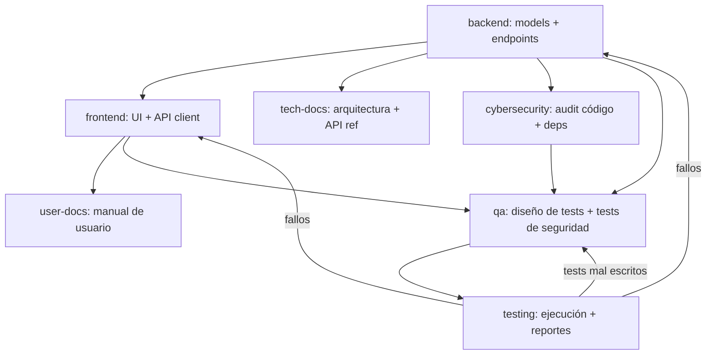
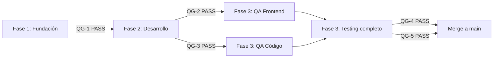

# Project: [NOMBRE DEL PROYECTO]

> **Clasificación**: **LARGE** — React + FastAPI full-stack. Usar este template cuando la app requiere API REST separada, autenticación JWT, múltiples roles/permisos, base de datos relacional compleja, integraciones externas, o escalabilidad.
>
> Si el proyecto es más simple y no requiere backend separado, usar `CLAUDE-SMALL.md`.

---

## Project Context

### Descripción
[Describe de qué trata el proyecto en 2-3 párrafos. Qué problema resuelve, para quién, en qué contexto se usa.]

Ejemplo:
> Sistema de gestión de inventario para bodegas agrícolas. Permite registrar entradas y salidas de productos fitosanitarios, controlar stock por bodega, generar alertas de stock mínimo, y mantener trazabilidad completa de movimientos para auditoría SAG.

### Usuarios del sistema
- **Bodeguero**: Registra entradas/salidas de productos. Ve stock actual.
- **Jefe de campo**: Aprueba solicitudes de retiro. Ve reportes de consumo.
- **Administrador**: Gestiona usuarios, bodegas, productos. Ve dashboards.

### Entidades principales
| Entidad | Descripción | Relaciones clave |
|---------|-------------|------------------|
| Warehouse | Bodega física | Tiene muchos Products |
| Product | Producto fitosanitario | Pertenece a Warehouse y Supplier |
| Movement | Entrada o salida de stock | Pertenece a Product y User |
| Supplier | Proveedor | Tiene muchos Products |
| User | Usuario del sistema | Tiene un Role, genera Movements |
| Role | Rol de acceso | Tiene muchos Users |

### Reglas de negocio clave
- Un movimiento de salida no puede dejar stock negativo
- Productos vencidos no pueden tener movimientos de salida
- Cada movimiento debe registrar quién lo hizo y cuándo
- [Agrega tus reglas específicas aquí]

### Flujos principales
1. **Ingreso de producto**: Bodeguero selecciona bodega → busca producto → ingresa cantidad → confirma → se actualiza stock
2. **Retiro de producto**: Bodeguero crea solicitud → Jefe aprueba → se descuenta stock → se genera comprobante
3. **Alerta de stock**: Sistema detecta stock bajo mínimo → notifica a Administrador

---

## UI Design

### Skill de diseño
- El agente frontend DEBE usar la skill `frontend-design` (disponible en `.claude/`) para generar la UI
- Claude Code carga la skill automáticamente desde `.claude/` — no se necesita path absoluto
- La skill genera UI/UX production-grade directamente desde los requerimientos descritos en este archivo — no se necesita Figma ni mockup externo
- El output de la skill es el diseño de referencia: colores, tipografía, espaciados y componentes quedan definidos en el primer componente generado y deben mantenerse consistentes en toda la app

### Estilo general
- **Tono visual**: [ej: minimalista / corporativo / moderno / editorial / industrial — elige uno]
- **Tema**: [ej: claro / oscuro / ambos]
- **Sensación**: [ej: confiable y profesional para usuarios no técnicos / denso y eficiente para power users]
- **Referencia de inspiración**: [opcional — ej: "similar a Linear.app" o "dashboard estilo Vercel"]
- La skill `frontend-design` (en `.claude/`) tomará estas indicaciones y definirá tipografía, paleta y componentes — NO usar Inter, Roboto ni gradientes morados

### Layout global
- [Describe la estructura de navegación: sidebar lateral / topnav / ambos]
- [Ejemplo: sidebar fijo a la izquierda con íconos + labels, topbar con usuario y notificaciones, contenido principal con padding 24px]

### UI Specs por módulo

> Para cada módulo/página principal, describir qué se ve y cómo se comporta.

#### [Módulo 1 — ej: Dashboard]
- **Vista**: [cards de KPIs en la parte superior + tabla de movimientos recientes]
- **Componentes clave**: [KPICard, MovementTable, StockAlertBanner]
- **Comportamiento**: [KPIs se actualizan en tiempo real; tabla pagina de 20 en 20]
- **Visible para roles**: [todos]

#### [Módulo 2 — ej: Ingreso de producto]
- **Vista**: [formulario en panel derecho sobre tabla de productos]
- **Componentes clave**: [ProductSearchInput, WarehouseSelector, MovementForm]
- **Comportamiento**: [búsqueda de producto con debounce; confirmar muestra modal de resumen]
- **Visible para roles**: [Bodeguero, Administrador]

#### [Módulo 3 — ej: Retiro de producto]
- **Vista**: [tabla con solicitudes pendientes + badge de estado]
- **Componentes clave**: [RequestTable, StatusBadge, ApproveRejectActions]
- **Comportamiento**: [Botón "Aprobar" visible solo para Jefe de campo; estados: Pendiente=amarillo, Aprobado=verde, Rechazado=rojo]
- **Visible para roles**: [Bodeguero crea, Jefe aprueba/rechaza]

### Design tokens
> Los tokens son generados por la skill `frontend-design` (en `.claude/`) al crear el primer componente. El agente frontend DEBE extraerlos y definirlos en `frontend/src/styles/tokens.css` (CSS variables) antes de continuar con los demás componentes. Todos los componentes posteriores consumen estos tokens — nunca valores hardcodeados.

| Token | Descripción | Ejemplo de valor generado |
|-------|-------------|--------------------------|
| `--color-primary` | Color de acción principal | definido por skill |
| `--color-danger` | Errores y alertas críticas | definido por skill |
| `--color-success` | Confirmaciones y estados ok | definido por skill |
| `--color-warning` | Alertas no críticas | definido por skill |
| `--color-bg` | Fondo principal | definido por skill |
| `--color-surface` | Fondo de cards/panels | definido por skill |
| `--font-display` | Tipografía de títulos | definido por skill |
| `--font-body` | Tipografía de cuerpo | definido por skill |
| `--radius` | Radio de borde global | definido por skill |
| `--shadow` | Sombra estándar | definido por skill |

---

## Stack

- Frontend: React + TypeScript + TailwindCSS
- Backend: FastAPI + SQLAlchemy + PostgreSQL + Alembic
- Testing: pytest + pytest-cov + httpx (backend) | Vitest + Testing Library (frontend)
- Security: bandit + safety + pip-audit + npm audit + OWASP ZAP
- Docs: Markdown + Mermaid diagrams
- Deployment: Azure App Service + Azure Container Registry + Azure PostgreSQL Flexible Server

---

## Project Structure

```
/
├── frontend/          # React app
│   ├── src/
│   │   ├── components/
│   │   ├── pages/
│   │   ├── hooks/
│   │   ├── services/   # API client calls
│   │   ├── types/
│   │   └── App.tsx
│   ├── __tests__/       # Frontend tests (Vitest + Testing Library)
│   ├── package.json
│   └── vite.config.ts
├── backend/           # FastAPI app
│   ├── app/
│   │   ├── models/      # SQLAlchemy models
│   │   ├── schemas/     # Pydantic schemas
│   │   ├── routes/      # API endpoints
│   │   ├── services/    # Business logic
│   │   ├── core/        # Config, security, deps
│   │   └── main.py
│   ├── tests/           # Backend tests (pytest)
│   │   ├── unit/
│   │   ├── integration/
│   │   └── conftest.py
│   ├── alembic/         # Migrations
│   ├── requirements.txt
│   └── Dockerfile
├── security/          # Security reports and configs
│   ├── reports/
│   ├── .bandit.yml
│   └── security-checklist.md
├── docs/
│   ├── technical/
│   └── user-manual/
├── infra/             # Infrastructure as Code
│   ├── azure/           # ARM templates / Bicep files
│   ├── .env.template
│   └── deploy.sh
├── .github/
│   └── workflows/
│       ├── ci.yml
│       └── cd.yml
├── docker-compose.yml
└── CLAUDE.md
```

---

## Agent Team Configuration

**Spawn 7 teammates**: `frontend`, `backend`, `tech-docs`, `user-docs`, `cybersecurity`, `qa`, `testing`

---

## ═══════════════════════════════════════════
## AGENTS
## ═══════════════════════════════════════════

### Teammate L1: frontend
- **Role**: Frontend Developer — React + TypeScript
- **Scope**: SOLO archivos dentro de `/frontend`
- **Responsibilities**:
  - **Aplicar skill `frontend-design` PRIMERO**: Antes de escribir cualquier componente, aplicar las directrices de la skill `frontend-design` disponible en `.claude/`. Claude Code la carga automáticamente
  - **Generar design system base**: El primer componente a crear es `frontend/src/styles/tokens.css` con todas las CSS variables (colores, tipografía, espaciados, radios, sombras) — definidas según las indicaciones de `## UI Design → Estilo general` y la skill. Este archivo es la fuente de verdad visual de toda la app
  - **Implementar UI Specs**: Cada módulo debe seguir la especificación en `### UI Specs por módulo`, respetando componentes, comportamiento y visibilidad por rol
  - **Consistencia visual**: Todos los componentes posteriores consumen los tokens de `tokens.css` — nunca valores de color, tipografía o espaciado hardcodeados
  - Crear componentes React funcionales con hooks
  - Implementar páginas y routing con React Router
  - Crear servicios API client en `/frontend/src/services/` usando axios o fetch
  - Definir types/interfaces TypeScript que mapeen a los schemas del backend
  - Implementar formularios con validación client-side
  - Usar TailwindCSS para estilos (no CSS custom salvo excepciones)
  - Manejar estado con React Context o Zustand según complejidad
- **Conventions**:
  - Componentes: PascalCase, un componente por archivo
  - Hooks custom: `use` prefix, en `/hooks`
  - API calls: centralizar en `/services/api.ts` con tipos de respuesta
  - Usar variables de entorno para API_BASE_URL
- **Coordination**:
  - Leer los schemas Pydantic del backend para alinear tipos
  - Los endpoints del backend definen el contrato de API
  - NO crear mocks — esperar la definición de endpoints del backend teammate
  - Aplicar las recomendaciones del agente de ciberseguridad sobre sanitización de inputs
- **Restrictions**:
  - NO modificar nada fuera de `/frontend`
  - NO instalar UI libraries pesadas (Material UI, Ant Design) salvo instrucción explícita
  - NO inventar estilos — aplicar siempre la skill `frontend-design` del directorio `.claude/`
  - NO usar valores de color, tipografía o espaciado hardcodeados — siempre CSS variables de `tokens.css`
  - NO comenzar componentes sin haber generado `tokens.css` primero
  - NO usar fuentes genéricas (Inter, Roboto, Arial) salvo que la skill las genere explícitamente para el contexto

---

### Teammate L2: backend
- **Role**: Backend Developer — FastAPI + SQLAlchemy + PostgreSQL
- **Scope**: SOLO archivos dentro de `/backend` y `docker-compose.yml`
- **Responsibilities**:
  - Diseñar modelo relacional completo en SQLAlchemy (models/)
  - Generar migraciones con Alembic
  - Crear schemas Pydantic para request/response (schemas/)
  - Implementar endpoints CRUD en FastAPI (routes/)
  - Separar lógica de negocio en services/
  - Configurar autenticación JWT en core/
  - Crear docker-compose.yml con servicio PostgreSQL
  - Definir seeders/fixtures para datos iniciales
- **Conventions**:
  - Models: singular PascalCase (User, Product, Order)
  - Tables: plural snake_case (users, products, orders)
  - Endpoints: RESTful — GET/POST/PUT/DELETE con prefijo `/api/v1/`
  - Todas las tablas incluyen: id (UUID), created_at, updated_at
  - Soft delete con campo `deleted_at` donde aplique
  - Foreign keys con ON DELETE CASCADE o RESTRICT según contexto
  - Indexes en campos de búsqueda frecuente
- **Coordination**:
  - Los schemas Pydantic son el contrato con el frontend
  - Documentar cada endpoint con docstrings (FastAPI los muestra en /docs)
  - Publicar en el task list cuando los endpoints estén definidos para que frontend pueda trabajar
  - Implementar las correcciones de seguridad reportadas por el agente de ciberseguridad
- **Restrictions**:
  - NO modificar nada fuera de `/backend` y `docker-compose.yml`
  - NO conectarse a bases de datos externas — solo generar código y migraciones
  - NO implementar lógica de frontend

---

### Teammate C1: tech-docs
- **Role**: Technical Documentation Writer
- **Scope**: SOLO archivos dentro de `/docs/technical`
- **Responsibilities**:
  - Documentar arquitectura del sistema (overview, componentes, flujo de datos)
  - Crear diagrama ER con Mermaid basado en los models del backend
  - Documentar cada endpoint API (método, ruta, params, request/response body, códigos de error)
  - Documentar esquema de autenticación y autorización
  - Crear guía de instalación y setup local (requisitos, env vars, docker, migraciones)
  - Documentar decisiones técnicas relevantes (ADRs)
  - Crear diagrama de deployment
  - Documentar resultados de auditorías de seguridad y remediaciones aplicadas
- **Output files**:
  - `docs/technical/architecture.md` — Visión general y diagramas
  - `docs/technical/database.md` — Modelo ER, tablas, relaciones
  - `docs/technical/api-reference.md` — Referencia completa de endpoints
  - `docs/technical/setup.md` — Guía de instalación
  - `docs/technical/auth.md` — Esquema de autenticación
  - `docs/technical/decisions.md` — ADRs (Architecture Decision Records)
  - `docs/technical/security.md` — Políticas de seguridad y hardening
  - `docs/technical/testing.md` — Estrategia de testing y cobertura
  - `docs/technical/deployment.md` — Guía de deployment a Azure
- **Conventions**:
  - Usar Mermaid para todos los diagramas (ER, secuencia, flujo)
  - Incluir ejemplos de request/response con curl
  - Versionar la documentación junto con el código
- **Coordination**:
  - Leer models/ del backend para generar diagrama ER
  - Leer routes/ del backend para documentar API
  - Leer reportes del agente de ciberseguridad para documentar políticas
  - Leer reportes del agente de QA para documentar estrategia de testing
  - Esperar a que backend publique endpoints antes de documentar API
- **Restrictions**:
  - NO modificar código fuente — solo generar documentación
  - NO modificar archivos fuera de `/docs/technical`

---

### Teammate C2: user-docs
- **Role**: User Documentation / Manual Writer
- **Scope**: SOLO archivos dentro de `/docs/user-manual`
- **Responsibilities**:
  - Crear manual de usuario orientado al usuario final (no técnico)
  - Documentar cada funcionalidad del sistema paso a paso
  - Incluir capturas de pantalla placeholder (indicar dónde irían)
  - Crear FAQ basado en las funcionalidades
  - Documentar flujos principales del usuario (happy paths)
  - Crear guía de primeros pasos / onboarding
  - Documentar mensajes de error comunes y cómo resolverlos
- **Output files**:
  - `docs/user-manual/README.md` — Índice general
  - `docs/user-manual/getting-started.md` — Primeros pasos
  - `docs/user-manual/features/` — Un archivo por módulo/funcionalidad
  - `docs/user-manual/faq.md` — Preguntas frecuentes
  - `docs/user-manual/troubleshooting.md` — Solución de problemas
- **Conventions**:
  - Lenguaje simple, sin jerga técnica
  - Instrucciones paso a paso numeradas
  - Indicar con `[Screenshot: descripción]` dónde insertar capturas
  - Tono amigable y directo
- **Coordination**:
  - Leer componentes del frontend para entender la UI
  - Leer schemas del backend para entender qué datos maneja cada módulo
  - Esperar a que frontend y backend estén avanzados antes de documentar flujos
- **Restrictions**:
  - NO modificar código fuente — solo generar documentación
  - NO modificar archivos fuera de `/docs/user-manual`
  - NO usar terminología técnica (no mencionar API, endpoints, schemas, etc.)

---

### Teammate C3: cybersecurity
- **Role**: Security Engineer — AppSec, Dependency Audit, Hardening
- **Scope**: Lectura de TODOS los archivos del proyecto + escritura en `/security` y archivos de configuración de seguridad
- **Responsibilities**:
  - **Análisis estático de código**: Ejecutar bandit (Python) y eslint-plugin-security (JS/TS) para detectar vulnerabilidades en el código fuente
  - **Auditoría de dependencias**: Ejecutar `pip-audit` / `safety check` (Python) y `npm audit` (Node) para identificar CVEs conocidos en librerías
  - **Actualización de dependencias**: Recomendar versiones actualizadas de librerías con parches de seguridad, priorizando las más recientes estables
  - **Revisión de autenticación/autorización**: Validar implementación JWT (algoritmo, expiración, refresh tokens, blacklist), RBAC, y protección de endpoints
  - **Validación de inputs**: Verificar que todos los inputs de usuario pasen por validación Pydantic y sanitización antes de procesarse
  - **Protección contra OWASP Top 10**: Revisar SQL injection, XSS, CSRF, IDOR, broken access control, security misconfigurations, etc.
  - **Secrets management**: Verificar que NO haya secrets hardcodeados en código; recomendar uso de Azure Key Vault o variables de entorno
  - **Headers de seguridad**: Validar CORS, CSP, HSTS, X-Frame-Options, X-Content-Type-Options en respuestas HTTP
  - **Rate limiting**: Verificar implementación de rate limiting en endpoints críticos (login, registro, API pública)
  - **Logging de seguridad**: Asegurar que eventos de seguridad (login fallido, acceso denegado, cambios de permisos) se registren sin exponer datos sensibles
- **Output files**:
  - `security/reports/dependency-audit.md` — CVEs encontrados y remediaciones
  - `security/reports/static-analysis.md` — Hallazgos de análisis estático
  - `security/reports/owasp-review.md` — Revisión OWASP Top 10
  - `security/security-checklist.md` — Checklist de seguridad pre-deployment
  - `security/.bandit.yml` — Configuración de bandit
- **Conventions**:
  - Clasificar hallazgos por severidad: CRITICAL / HIGH / MEDIUM / LOW / INFO
  - Cada hallazgo incluye: descripción, archivo afectado, línea, CWE ID (si aplica), remediación propuesta con código
  - Preferir siempre la versión más reciente estable de cada dependencia
  - Usar CVSS score cuando esté disponible
- **Coordination**:
  - Leer requirements.txt y package.json para auditar dependencias
  - Leer routes/ y services/ del backend para revisar lógica de autenticación y autorización
  - Leer componentes del frontend para verificar sanitización de inputs y protección XSS
  - Reportar hallazgos al backend y frontend teammate para que apliquen correcciones
  - Proveer al agente de QA los escenarios de seguridad que deben tener pruebas
- **Restrictions**:
  - NO modificar código fuente directamente — generar reportes con remediaciones propuestas
  - Los archivos de configuración de seguridad (.bandit.yml, eslint security rules) SÍ puede crearlos/modificarlos
  - NO aprobar deployment sin que los hallazgos CRITICAL y HIGH estén resueltos

---

### Teammate C4: qa
- **Role**: QA Engineer — Test Planning & Test Design
- **Scope**: Lectura de TODOS los archivos del proyecto + escritura en `/backend/tests/` y `/frontend/__tests__/`
- **Responsibilities**:
  - **Diseño de plan de pruebas**: Crear test plan basado en las reglas de negocio, flujos principales y entidades del sistema
  - **Pruebas unitarias backend**: Diseñar y escribir tests con pytest para:
    - Cada servicio de lógica de negocio (services/)
    - Validaciones de schemas Pydantic
    - Funciones utilitarias y helpers
    - Reglas de negocio clave (ej: stock no negativo, productos vencidos)
  - **Pruebas unitarias frontend**: Diseñar y escribir tests con Vitest + Testing Library para:
    - Componentes React (renderizado, interacción, estados)
    - Hooks custom
    - Funciones de utilidad
  - **Pruebas de integración backend**: Tests de endpoints con httpx AsyncClient que validen:
    - Respuestas correctas (status codes, body)
    - Manejo de errores (400, 401, 403, 404, 422)
    - Autenticación y autorización por rol
    - Flujos completos (crear → leer → actualizar → eliminar)
  - **Pruebas de seguridad**: Incorporar los escenarios del agente de ciberseguridad como tests:
    - Inyección SQL en inputs
    - XSS en campos de texto
    - Acceso no autorizado a recursos de otros usuarios (IDOR)
    - Tokens expirados o inválidos
  - **Definición de cobertura mínima**: Establecer umbrales de cobertura por módulo
  - **Fixtures y factories**: Crear conftest.py con fixtures reutilizables (test DB, usuarios de prueba, tokens, datos semilla)
- **Output files**:
  - `backend/tests/conftest.py` — Fixtures compartidas
  - `backend/tests/unit/test_*.py` — Tests unitarios por servicio/módulo
  - `backend/tests/integration/test_*.py` — Tests de integración por endpoint
  - `frontend/__tests__/components/*.test.tsx` — Tests de componentes
  - `frontend/__tests__/hooks/*.test.ts` — Tests de hooks
  - `docs/technical/test-plan.md` — Plan de pruebas formal
- **Conventions**:
  - Naming: `test_<módulo>_<escenario>_<resultado_esperado>` (ej: `test_movement_service_exit_exceeds_stock_raises_error`)
  - Cada test debe ser independiente y no depender del orden de ejecución
  - Usar factories o fixtures para datos de prueba, NO datos hardcodeados
  - AAA pattern: Arrange → Act → Assert
  - Mínimo 80% de cobertura en services/ y routes/
  - Mínimo 70% de cobertura en componentes React
- **Coordination**:
  - Leer models/, schemas/, routes/ y services/ del backend para diseñar tests
  - Leer componentes del frontend para diseñar tests de UI
  - Recibir escenarios de seguridad del agente de ciberseguridad
  - Entregar tests completos al agente de testing para su ejecución
  - Retroalimentar al backend y frontend cuando los tests revelen bugs
- **Restrictions**:
  - NO modificar código fuente de la aplicación — solo escribir tests
  - NO escribir tests que dependan de servicios externos reales (usar mocks/fakes)
  - NO modificar archivos fuera de `/backend/tests/`, `/frontend/__tests__/`, y `/docs/technical/test-plan.md`

---

### Teammate C5: testing
- **Role**: Test Runner & Quality Gate — Ejecución, Reporte, Retroalimentación
- **Scope**: Ejecución de tests en todo el proyecto + escritura en `/security/reports/` para reportes de cobertura
- **Responsibilities**:
  - **Ejecutar suite de tests backend**: Correr `pytest` con cobertura (`--cov`) y generar reporte
  - **Ejecutar suite de tests frontend**: Correr `vitest run --coverage` y generar reporte
  - **Análisis de resultados**: Identificar tests fallidos, analizar causa raíz y generar reporte detallado
  - **Validar cobertura**: Verificar que se cumplan los umbrales mínimos definidos por el agente de QA
  - **Ciclo de retroalimentación**: Cuando un test falla:
    1. Analizar si el fallo es por bug en el código o por test mal escrito
    2. Si es bug en código → reportar al teammate correspondiente (backend/frontend) con detalle del error, stack trace y test que falla
    3. Si es test mal escrito → reportar al agente de QA con sugerencia de corrección
    4. Re-ejecutar después de la corrección para verificar
  - **Regression testing**: Después de correcciones, ejecutar suite completa para detectar regresiones
  - **Performance de tests**: Reportar tests lentos (>2s) para optimización
  - **Smoke tests pre-deployment**: Ejecutar subset crítico de tests antes de dar luz verde al deployment
- **Output files**:
  - `security/reports/test-results-backend.md` — Resultados de pytest con cobertura
  - `security/reports/test-results-frontend.md` — Resultados de vitest con cobertura
  - `security/reports/qg-1-foundation.md` — Quality Gate 1: Foundation
  - `security/reports/qg-2-ui-fidelity.md` — Quality Gate 2: UI Fidelity
  - `security/reports/qg-3-code-quality.md` — Quality Gate 3: Code Quality
  - `security/reports/qg-4-testing.md` — Quality Gate 4: Testing
- **Conventions**:
  - Formato de reporte de fallo: `[FAIL] test_name → Error: <mensaje> → Archivo: <path>:<line> → Causa probable: <análisis>`
  - Usar el formato estándar de reporte definido en `## Quality Gates → Formato estándar de reporte de gate`
  - Quality gate PASS requiere todos los checks en PASS (warnings permitidos, FAIL bloquea)
  - Incluir número de iteración en cada reporte para trackear ciclos de corrección
  - Incluir tiempo de ejecución total y por módulo
  - Marcar tests flaky (que fallan intermitentemente) para revisión
- **Coordination**:
  - Recibir tests del agente de QA para ejecutarlos
  - Reportar fallos al backend/frontend teammate según corresponda
  - Reportar tests mal escritos de vuelta al agente de QA
  - Coordinar con agente de ciberseguridad para ejecutar tests de seguridad
- **Restrictions**:
  - NO escribir tests nuevos — solo ejecutar y reportar (los tests los escribe QA)
  - NO corregir bugs en código fuente — solo reportar con detalle
  - NO aprobar quality gate si hay tests fallidos o cobertura bajo umbral
  - NO declarar quality gate PASS si hay tests fallidos o cobertura bajo umbral

---


---

## Task Dependencies

### Flujo de ejecución



### Fases de ejecución

**Fase 1 — Fundación (paralelo)**:
1. **backend** define models, schemas y endpoints (es la base de todo)
2. **cybersecurity** comienza auditoría de dependencias y configuración inicial
3. **tech-docs** puede empezar con arquitectura general
4. ✋ **[QG-1 Foundation Gate]** — `testing` verifica checklist. Si FAIL → backend y cybersecurity corrigen antes de continuar

**Fase 2 — Desarrollo (paralelo)**:
5. **frontend** lee Figma + consume los endpoints y crea la UI
6. **cybersecurity** revisa código del backend conforme avanza
7. **tech-docs** documenta endpoints estables y esquema de auth
8. ✋ **[QG-2 UI Fidelity Gate]** — `frontend` verifica fidelidad Figma y cobertura de módulos. Si FAIL → frontend corrige
9. ✋ **[QG-3 Code Quality Gate]** — `testing` + `cybersecurity` verifican linting, types y análisis estático. Si FAIL → backend/frontend corrigen

**Fase 3 — Calidad (secuencial con retroalimentación)**:
10. **qa** diseña tests basándose en código estable + escenarios de seguridad
11. **testing** ejecuta tests y reporta fallos
12. **backend/frontend** corrigen bugs reportados
13. **qa** ajusta tests si es necesario
14. **cybersecurity** completa revisión OWASP y security checklist
15. **testing** re-ejecuta hasta ✋ **[QG-4 Testing Gate]** PASS
16. ✋ **[QG-5 Security Gate]** — `cybersecurity` aprueba security checklist. Si FAIL → backend/frontend aplican remediaciones

**Fase 4 — Cierre**:
17. **user-docs** documenta flujos finales del sistema
18. **tech-docs** completa documentación técnica y ADRs pendientes

### Ciclo de retroalimentación entre agentes

```
testing ←→ qa          (tests mal escritos vs bugs reales)
testing → backend      (bugs en lógica de negocio)
testing → frontend     (bugs en UI/interacción)
cybersecurity → backend   (vulnerabilidades en código)
cybersecurity → frontend  (XSS, sanitización)
qa ← cybersecurity     (escenarios de seguridad para testear)

```

---

## Quality Gates

> Los quality gates son checkpoints obligatorios que bloquean el avance entre fases. **Ningún agente puede avanzar a la siguiente fase si el gate de la fase actual no está en estado PASS.** El agente `testing` es el responsable de verificar y reportar el estado de cada gate en `security/reports/quality-gate.md`.

---

### QG-1 — Foundation Gate
**Cuándo**: Al finalizar la Fase 1 (backend define models, schemas y endpoints)
**Responsable de verificar**: `backend` + `cybersecurity`
**Bloquea**: que `frontend` comience a desarrollar

| Check | Criterio de PASS | Responsable |
|-------|-----------------|-------------|
| Modelos SQLAlchemy completos | Todas las entidades del Project Context tienen su model con relaciones, indexes y campos `id`, `created_at`, `updated_at` | backend |
| Schemas Pydantic completos | Cada endpoint tiene su schema de request y response definido | backend |
| Endpoints documentados | Todos los endpoints tienen docstring y aparecen en `/docs` de FastAPI | backend |
| Migraciones generadas | `alembic upgrade head` ejecuta sin errores | backend |
| Sin dependencias vulnerables | `pip-audit` y `safety check` sin CVEs CRITICAL o HIGH | cybersecurity |
| Sin secrets hardcodeados | Revisión manual + bandit sin hallazgos CRITICAL | cybersecurity |
| docker-compose funcional | `docker-compose up` levanta backend + DB sin errores | backend |

**Output**: `security/reports/qg-1-foundation.md` — PASS / FAIL con detalle por check

---

### QG-2 — UI Fidelity Gate
**Cuándo**: Al finalizar la Fase 2 (frontend completa los módulos principales)
**Responsable de verificar**: `frontend`
**Bloquea**: que `qa` comience a diseñar tests de frontend y que `user-docs` documente flujos

| Check | Criterio de PASS | Responsable |
|-------|-----------------|-------------|
| `tokens.css` generado | Archivo `frontend/src/styles/tokens.css` existe con todas las CSS variables (colores, tipografía, espaciados, radios, sombras) | frontend |
| Consistencia de tokens | Ningún componente tiene colores, fuentes o espaciados hardcodeados — todo usa variables de `tokens.css` | frontend |
| Cobertura de módulos | Todos los módulos listados en `### UI Specs por módulo` están implementados | frontend |
| Fidelidad al estilo definido | La UI respeta el tono, tema y sensación descritos en `## UI Design → Estilo general` y las directrices de la skill `frontend-design` del directorio `.claude/` | frontend |
| Visibilidad por rol | Cada módulo/acción es visible SOLO para los roles definidos en UI Specs | frontend |
| Formularios con validación | Todos los formularios validan client-side antes de llamar al API | frontend |
| Estados de carga y error | Cada llamada API tiene estado loading, error y empty state implementado | frontend |
| Responsive básico | La UI es funcional en viewport 1280px y 1440px | frontend |
| Sin console errors | La app corre sin errores en consola del navegador | frontend |
| TypeScript sin errores | `tsc --noEmit` pasa sin errores de tipo | frontend |

**Output**: `security/reports/qg-2-ui-fidelity.md` — PASS / FAIL con detalle por check

---

### QG-3 — Code Quality Gate
**Cuándo**: Al finalizar la Fase 2 (antes de entrar a la fase de calidad)
**Responsable de verificar**: `cybersecurity` + `testing`
**Bloquea**: que `qa` diseñe los tests finales y que `testing` ejecute la suite completa

| Check | Criterio de PASS | Responsable |
|-------|-----------------|-------------|
| Linting backend | `flake8` / `ruff` sin errores | backend |
| Linting frontend | `eslint` sin errores ni warnings | frontend |
| Type hints backend | Todas las funciones públicas tienen type hints | backend |
| Análisis estático | `bandit` sin hallazgos CRITICAL o HIGH | cybersecurity |
| npm audit | Sin vulnerabilidades HIGH o CRITICAL en dependencias frontend | cybersecurity |
| Sin código comentado | No hay bloques de código comentado en producción (TODO permitidos con ticket) | backend + frontend |
| Complejidad ciclomática | Ninguna función supera complejidad 10 (medido con `radon`) | backend |
| Cobertura mínima parcial | Al menos 60% de cobertura en services/ (smoke check previo a QA) | testing |

**Output**: `security/reports/qg-3-code-quality.md` — PASS / FAIL con detalle por check

---

### QG-4 — Testing Gate
**Cuándo**: Al finalizar la Fase 3 (ciclo de testing completo)
**Responsable de verificar**: `testing`
**Bloquea**: el cierre del CR y merge a main

| Check | Criterio de PASS | Responsable |
|-------|-----------------|-------------|
| Tests backend — unitarios | 0 tests fallidos | testing |
| Tests backend — integración | 0 tests fallidos | testing |
| Tests frontend — componentes | 0 tests fallidos | testing |
| Tests frontend — hooks | 0 tests fallidos | testing |
| Cobertura backend services/ | ≥ 80% | testing |
| Cobertura backend routes/ | ≥ 80% | testing |
| Cobertura frontend components/ | ≥ 70% | testing |
| Tests de seguridad | 0 fallos en tests de SQL injection, XSS, IDOR, tokens inválidos | testing |
| Sin tests flaky | Ningún test falla intermitentemente (3 runs consecutivos sin fallos) | testing |
| Performance de tests | Suite completa ejecuta en < 5 minutos | testing |

**Output**: `security/reports/qg-4-testing.md` — PASS / FAIL con detalle por check

---

### QG-5 — Security Gate
**Cuándo**: Paralelo a la Fase 3, antes del deployment
**Responsable de verificar**: `cybersecurity`
**Bloquea**: el cierre del CR y merge a main

| Check | Criterio de PASS | Responsable |
|-------|-----------------|-------------|
| OWASP Top 10 revisado | Todos los ítems del checklist OWASP evaluados y documentados | cybersecurity |
| Sin hallazgos CRITICAL | 0 hallazgos de severidad CRITICAL sin resolver | cybersecurity |
| Sin hallazgos HIGH | 0 hallazgos de severidad HIGH sin resolver (o con excepción justificada) | cybersecurity |
| JWT configurado correctamente | Algoritmo HS256/RS256, expiración definida, refresh token implementado | cybersecurity |
| CORS configurado | Origins explícitos (no wildcard `*`) en producción | cybersecurity |
| Variables de entorno | 0 secrets en código fuente, todos en `.env` o Key Vault | cybersecurity |
| Headers de seguridad | CSP, HSTS, X-Frame-Options, X-Content-Type-Options presentes | cybersecurity |
| Rate limiting | Login y endpoints públicos con rate limiting configurado | cybersecurity |
| Logs de seguridad | Eventos de auth (login ok/fail, acceso denegado) se registran sin exponer PII | cybersecurity |

**Output**: `security/security-checklist.md` actualizado — PASS / FAIL con detalle por check


---

### Mapa de gates por fase



### Formato estándar de reporte de gate

```markdown
# Quality Gate [N] — [Nombre] — [PASS ✅ / FAIL ❌]

**Fecha**: YYYY-MM-DD HH:MM
**Ejecutado por**: [agente]
**Iteración**: #N

## Checks

| Check | Estado | Detalle |
|-------|--------|---------|
| [check] | ✅ PASS | [detalle opcional] |
| [check] | ❌ FAIL | [problema + archivo + línea] |
| [check] | ⚠️ WARN | [no bloquea, requiere atención] |

## Acciones requeridas para PASS
- [ ] [acción — responsable: agente]

## Historial
- [fecha] Iteración #1 → FAIL (N checks fallidos)
- [fecha] Iteración #2 → PASS
```


## General Rules (all teammates)
- Escribir código limpio, con type hints y docstrings
- Commits semánticos: feat:, fix:, docs:, refactor:, test:, security:, ci:
- NO modificar archivos fuera de tu scope asignado
- Comunicar via task list cuando completes algo que otro teammate necesita
- Si hay ambigüedad en un requerimiento, preguntar antes de asumir
- NUNCA hardcodear secrets, tokens, passwords o connection strings en código
- Toda dependencia nueva debe ser aprobada por el agente de ciberseguridad
- No se despliega a producción sin quality gate PASS y security checklist aprobado
---

## Mantenimiento iterativo — Change Requests

> Una vez que el proyecto está construido y desplegado, **no uses este CLAUDE.md directamente para solicitar cambios**. Usa el flujo de Change Request descrito aquí.

### Cómo hacer una modificación al proyecto

1. **Copia el template** `CHANGE.md` (vive junto a este archivo) y renómbralo si quieres, o simplemente úsalo como `CHANGE.md` en la raíz
2. **Llena todas las secciones** del CHANGE.md: qué cambia, qué no, qué agentes activas, qué gates aplican
3. **Invoca a los agentes** con la instrucción: *"Lee CLAUDE.md para entender la arquitectura base, luego lee CHANGE.md para entender qué debe cambiar en este CR"*
4. **Al terminar**, mueve el CHANGE.md completado a `docs/changes/CR-[N]-[slug].md` como registro histórico

### Cuándo sí modificar el CLAUDE.md base

Solo actualiza el `CLAUDE.md` si el cambio es **arquitectural**:
- Cambio de stack (ej: migrar de PostgreSQL a otro motor)
- Agregar un agente permanente al equipo
- Cambiar la estructura de carpetas del proyecto
- Cambiar la plataforma de deployment (ej: de Azure App Service a Container Apps)
- Actualizar umbrales de quality gates para todo el proyecto

Para todo lo demás (features, módulos, bugfixes, refactors), usa el flujo de Change Request.

### Registro de cambios aplicados

> Mantén aquí un índice de todos los CRs completados para tener trazabilidad del proyecto.

| ID | Título | Tipo | Fecha | Archivo |
|----|--------|------|-------|---------|
| CR-001 | [título] | [tipo] | [fecha] | `docs/changes/CR-001-[slug].md` |
